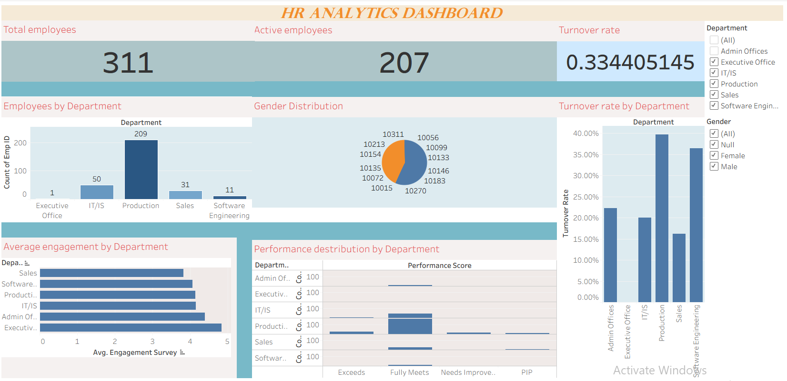

# HR-Analytics-Dashboard
HR Analytics Dashboard using Tableau

## Project Overview
This project analyzes employee data to understand workforce distribution, attrition trends, and performance using Tableau.

## Tools Used
- Tableau
- CSV Dataset

## Dashboard Features
- Total Employees KPI
- Active Employees KPI
- Turnover Rate KPI
- Department-wise Analysis
- Gender Distribution
- Performance Analysis

## Key Insights
- Total Employees: 311
- Turnover Rate: ~33%
- Some departments show higher attrition
- Workforce distribution is uneven
- Majority employees have average performance ratings

## Files Included
- Tableau Dashboard (.twbx)
- Project Report (PDF)

## Author
Gunjan Singh
